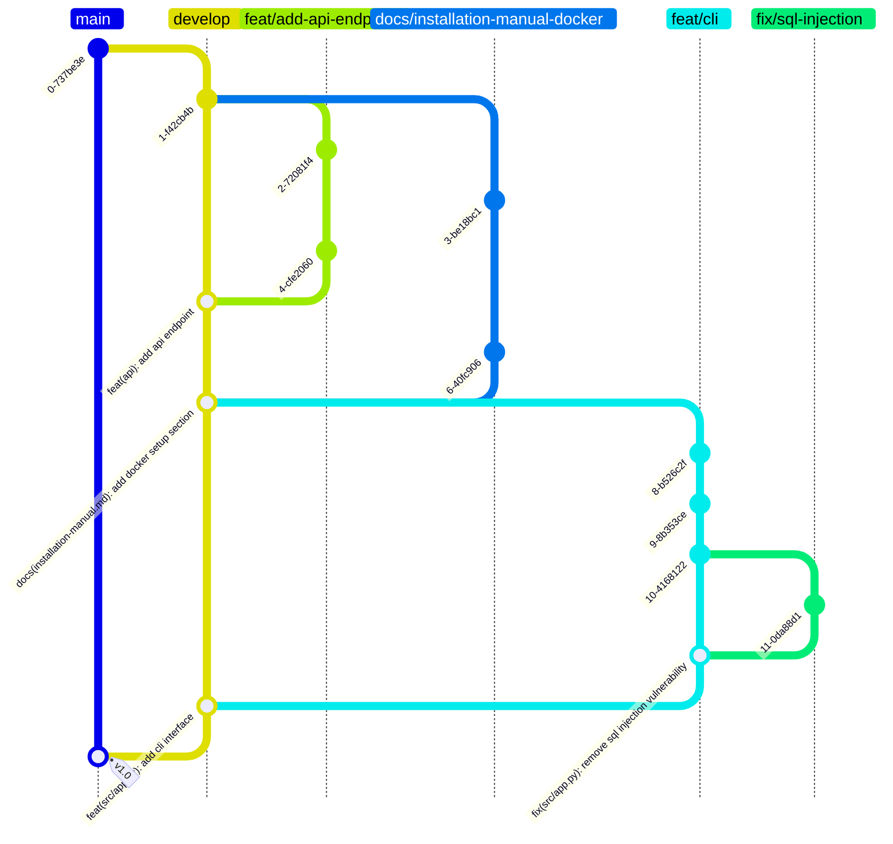

# VitalVue

## Brief Description

This project involves developing a Hospital Management System (HMS) that will
streamline hospital operations by managing patient care, scheduling, billing,
and resource allocation. The system will include functionalities for patients,
doctors, nurses, and assistants, with each having specific attributes and roles.
It will manage appointments, hospitalizations, surgeries, prescriptions, side
effects, and billing, with concurrency issues and triggers considered. Doctors
will have specializations organized hierarchically. any necessary database
schema details that are not explicitly defined should be determined.

## Functional Description

This project aims to develop a Hospital Management System (HMS). The development
of the database should fit the required functionalities and business
restrictions to ensure effective storage and information processing and
retrieval.

An HMS is designed to streamline and optimize the operations and workflows
within a healthcare facility. At its core, an HMS serves as a centralized
platform for managing various aspects of hospital administration, including
patient care, scheduling, billing, and resource allocation.

The primary actors of the system include patients and employees, with the latter
comprising doctors, nurses, and assistants, each with specific attributes (e.g.,
a doctor has information related to his/hers medical license; a nurse has an
internal hierarchical category). All employees have an employee id and the
contract details are also to be stored in the database. The system must be able
to manage the patients’ appointments and hospitalizations for surgeries (each
hospitalization might be associated with multiple surgeries). Each appointment
and surgery is conducted by a doctor and can have multiple nurses involved in
different specific roles. For each hospitalization there is one nurse that is
assigned as responsible. Obviously, no patient, doctor, or nurse can be in two
events at the same time. On the other hand, assistants contribute to the
operational efficiency by scheduling appointments and hospitalizations. Remember
that multiple users (e.g., patients) can use the system simultaneously and thus
concurrency issues must be taken into account.

Each appointment and hospitalization can be associated with prescriptions, which
define the dosage for each medication (each prescription can comprise multiple
medicines). The system also logs a catalog of side effects, and each medicine
has multiple side effects with specific occurrences and severity (multiple
medicines can have the same side effects, with different
probabilities/severity). 

The billing for each appointment and hospitalization must also be stored. For
simplicity, let’s assume that each appointment and each surgery has a fixed
cost. Whenever an appointment is scheduled or a surgery is added to a
hospitalization, a bill is created or updated (in the case that a bill had
already been created for previous surgery in a given hospitalization). This
process must be implemented using triggers. Each bill can be split into multiple
payments. 

Doctors specialize in various medical fields. Specializations can be
hierarchically organized (i.e., one specialization may have a parent
specialization), allowing for detailed categorization of medical expertise.  

Any details that are not specifically defined but that you feel are necessary to
develop the database schema should be explicitly defined.

## Setup

### Development Map

Git workflow example of this git repo:



### Python Virtual environment

```sh
make venv
```

## Features

## Technologies Used

- Python
- PostgreSQL

## Installation

To know how to install this project see the [Installation
Manual](/docs/installation-manual.md).

## How to Use

To check how to use this project see the [User Manual](/docs/user-manual.md)

## Contributing

Contributions are welcome. Please open a pull request with any changes or improvements.

## License

This project is licensed under the [MIT License](LICENSE). See the LICENSE file for more information.
